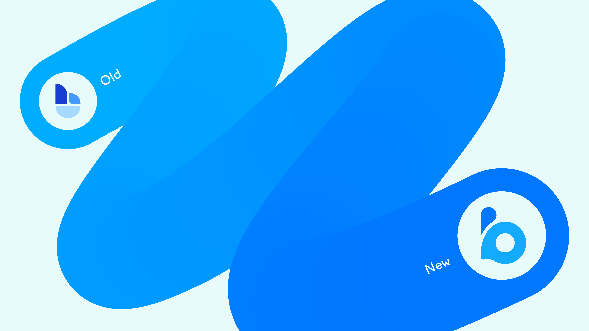

# 📣 Introduction

Blocto is built with two goals in mind:

1. **Make it simple for average users to use dApps**
2. **Make it simple for developers to build good dApps**

For these goals we have built:

1. [Blocto app](blocto-app/overview.md) to reduce entry barrier and improve dApp experience
2. [Blocto SDK](blocto-sdk/overview.md) to help developers build awesome dApps with minimal effort

<figure><figcaption></figcaption></figure>

#### Account Abstraction

Blocto wallets are built with chain-agnostic account abstraction. On chains with native account abstraction, such as [Aptos](https://aptos.dev) and [Flow](https://flow.com/), Blocto utilizes the native account system to provide account abstraction functionalities; On chains without native account abstraction, such as Ethereum, Polygon and Solana, Blocto builds uses smart contracts to achieve account abstraction. This gives Blocto wallets a lot of advantages over regular private-key wallets. To learn more about our ERC-4337 compliant wallet on Ethereum, check out[ this technical document](technical-documents/contract-wallet.md).


Blocto is in the process of refreshing our brand identity. Our new logo is the first of a number of visual changes you'll be seeing over the next few months. Join our Discord and stay updated for the latest news!



Blocto is under heavy development. New features come every week. [Subscribe to our mailing list](https://blocto.typeform.com/to/nJTnwcjv) so you don't miss out on our news.

