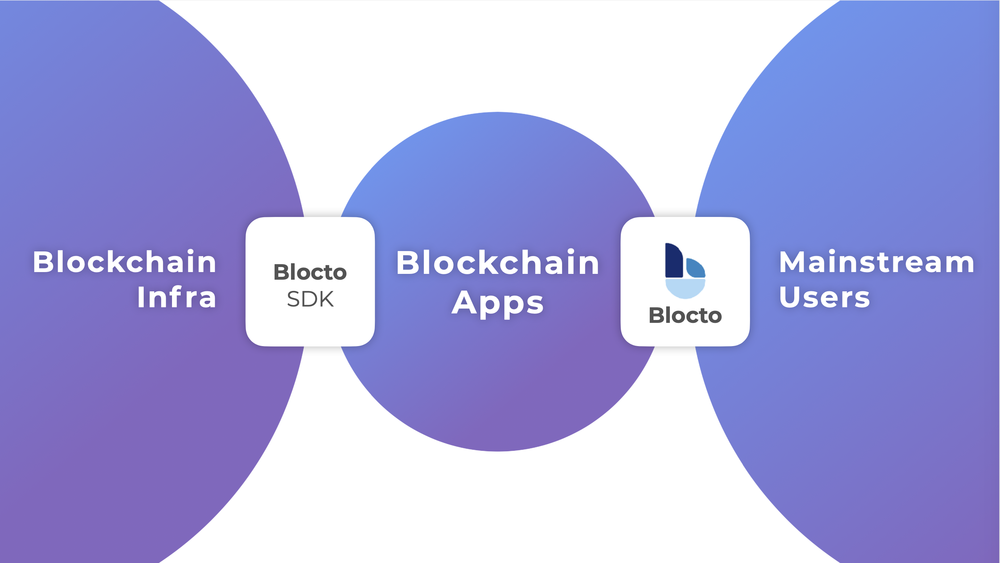

# Introduction

Blocto is built with two goals in mind:

1. **Make it simple for average users to use dApps**
2. **Make it simple for developers to build good dApps**

For these goals we have built:

1. [Blocto app](blocto-app/overview.md) to reduce entry barrier and improve dApp experience
2. [Blocto SDK](blocto-sdk/overview.md) to help developers build awesome dApps with minimal effort


Blocto is under heavy development. New features come every week. [Subscribe to our mailing list](https://blocto.typeform.com/to/nJTnwcjv) so you don't miss out on our news.


