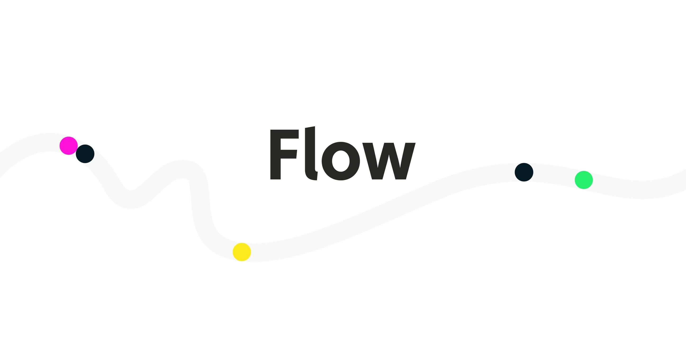

# Flow

### Flow

[Flow](https://onflow.org), built by [Dapper Labs](https://www.dapperlabs.com/), is a decentralized platform built to support the next generation of games, apps, and the digital assets that power them.

### Flow JavaScript SDK

Flow ships with a bundle JavaScript libraries including [Flow SDK](https://github.com/onflow/flow-js-sdk/tree/master/packages/sdk) and [Flow Client Library \(FCL\)](https://github.com/onflow/flow-js-sdk/tree/master/packages/fcl). With these libraries, web-based dApps can interact with Flow blockchain easily. If you're familiar with dApp development on Ethereum, they're basically the web3.js for Flow.

Flow Client Library, or FCL, defines how web-based dApps can interact with wallet providers like Blocto SDK. In the following sections, we will show you how to use Blocto wallet service in your Flow dApp.

