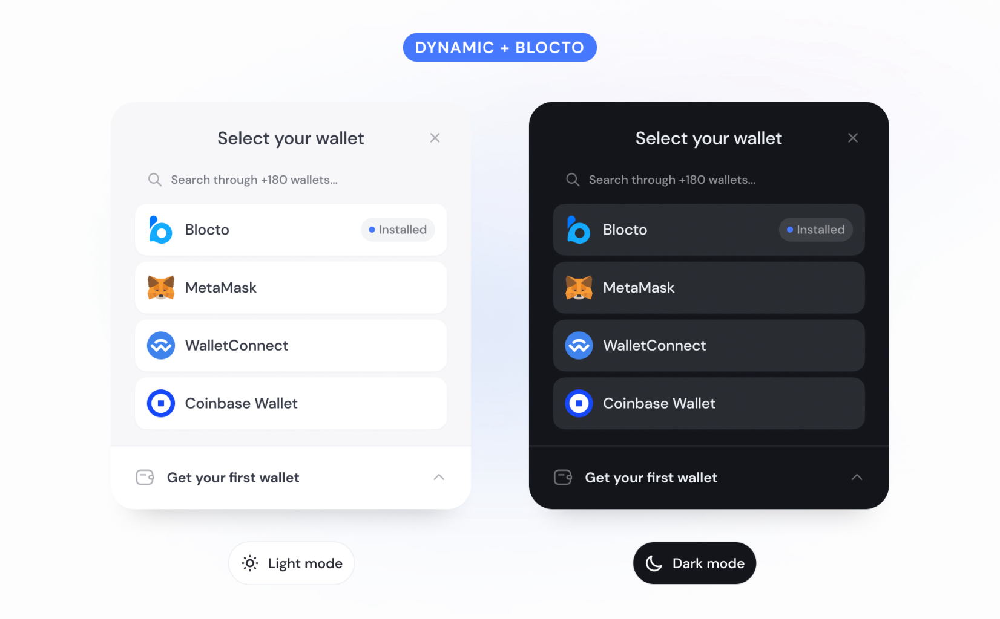

# Integrate with Dynamic

[Dynamic](https://docs.dynamic.xyz/docs/www.dynamic.xyz) is a powerful web3 auth developer platform that lets you integrate multiple wallets such as **Blocto**, and more into your app or website. Dynamic comes with Blocto Wallet built-in across both EVM and Flow.

<figure><figcaption></figcaption></figure>

### Installation

Install from npm/yarn/pnpm



```bash
npm i @dynamic-labs/sdk-react
```



```bash
yarn add @dynamic-labs/sdk-react
```



```bash
pnpm add @dynamic-labs/sdk-react
```



Check out step-by-step guide [here](https://docs.dynamic.xyz/docs/integrating-with-dynamic-blocto).


### CodeSandbox Sample


