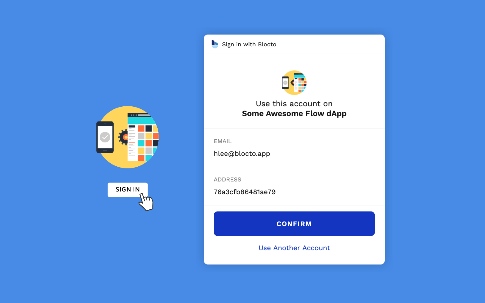

# Overview

### Blocto SDK

> The best blockchain experience is that user doesn't even realize it's a blockchain experience.

Blocto team has an OCD for user experience.

Although we have built Blocto app that provides top-tier user experience among wallet apps and browser extensions, it's still not the ideal experience we want to create: **It still requires a download process**.

That's why we're building Blocto SDK so dApp developers can embed the wallet service tightly into their dApps and improve user experience, especially for those who are not crypto-fluent.

### Advantages

#### Compared to stand-alone wallets

1. **No downloads needed**\
   Users stay in your dApp the entire time. They never have to download additional apps or browser extensions for your dApp to work.\

2. **Seamless on boarding**\
   User don't have to go through the painful wallet creation process, where they get intimidated by new ideas like seed phrases, private keys, addresses, ... etc. They can learn later, as they accumulate more assets in their wallets. ([See how our mixed custodial model works](../technical-documents/key-management.md))

#### Compared to other wallet SDKs

1. **Freemium model made possible**\
   You can pay transaction fees for your users to provide a freemium experience. They don't have to buy crypto to pay for fees before they try out your dApp. ([See how meta-transaction works](../technical-documents/contract-wallet.md#meta-transaction))\

2. **Integrated payment**\
   Get paid easily with our payment APIs. Users can pay easily with credit cards or other crypto currencies like Bitcoin, Ethereum, Tron, USDT, ... etc\

3. **Connected to Blocto App**\
   Once you've integrated with Blocto SDK, your users can manage their assets easily and securely through Blocto App. Your dApp can tap into the vast blockchain ecosystem instantly.\

4. **Supports multiple blockchains**\
   Blocto SDK supports Flow, Ethereum, Tron and a lot more to come. Blocto also helps users convert their assets across different chains.\

5. **Available in different languages and on different platforms**\
   Most wallet SDKs only supports JavaScript. Blocto SDK is available in JavaScript, Swift (iOS) and Kotlin (Android).
