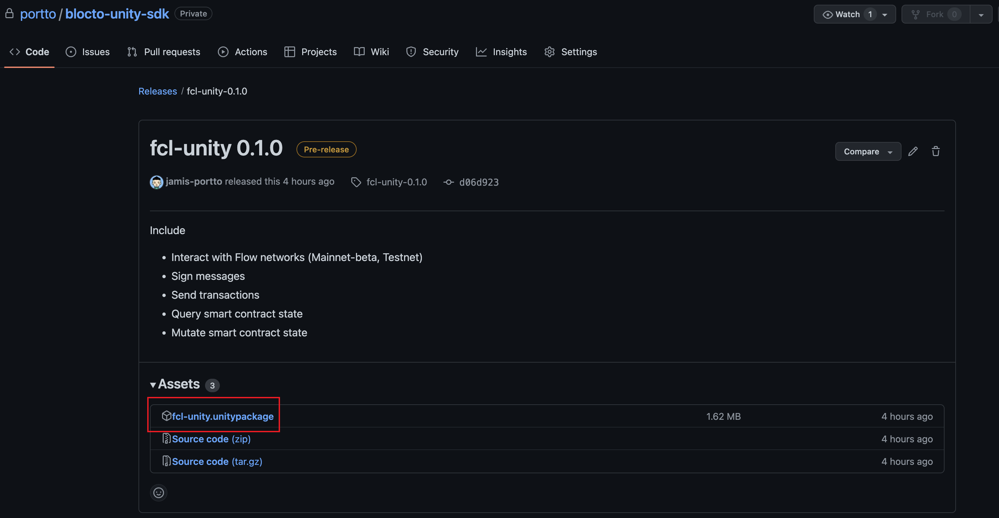

# Getting Started

In this guide we will show you prerequisite for Blocto Flow SDK.

A sample app is available at: [https://github.com/portto/blocto-unity-sdk](https://github.com/portto/blocto-unity-sdk)

## Installation

### Requirements <a href="#requirements" id="requirements"></a>

* .Net Core version >= 2.1
* iOS version >= 13
* android version >= 11

### Release Page

* FCL-SDK is available through [github](https://github.com/portto/blocto-unity-sdk/releases). You can download at github [release page](https://github.com/portto/blocto-unity-sdk/releases)

<figure><figcaption><p>FCL-Unity download page</p></figcaption></figure>

<figure><figcaption><p>Blocto-unity-SDK download page</p></figcaption></figure>

## Import .unitypackage

You can import **Standard Asset Packages**, which are asset collections pre-made and supplied with Unity, and **Custom Packages**, which are made by people using Unity. The more description at [unity document](https://docs.unity3d.com/Manual/AssetPackagesImport.html).

Choose **Assets > Import Package >** to import both types of package.

<figure><figcaption></figcaption></figure>

## Configuration

1. Register app id (bloctoSDKAppId) in order to init `BloctoWalletProvider`
2. Set the require Configuration, the more description please go to the [flow document](https://developers.flow.com/tools/fcl-js/reference/configure-fcl#common-configuration-keys)
3. Create BloctoWalletProvider instance and register it with flowclientlibrary

```csharp
using Flow.FCL;
using Flow.FCL.Config
using Blocto.SDK.Flow;

var config = new Config();
        config.Put("discovery.wallet", "https://flow-wallet-testnet.blocto.app/api/flow/authn")
              .Put("accessNode.api", "https://rest-testnet.onflow.org/v1")
              .Put("fcl.limit", "1000")
              .Put("flow.network", "testnet");
        
 var walletProvider = BloctoWalletProvider.CreateBloctoWalletProvider(
        gameObject: gameObject,
        bloctoAppIdentifier: {your's bloctoSDKAppId}
    );
    
 var fcl = new FlowClientLibrary.CreateClientLibrary(
    gameObject: gameObject, 
    initialFunc: GetFCL => {
                var fcl = GetFCL.Invoke();
                fcl.SetWalletProvider(_walletProvider);
                fcl.SetResolveUtility(new ResolveUtility());
                return fcl;
            }, 
    config: config);
```
