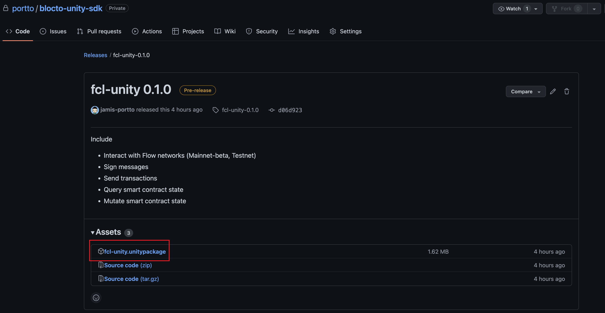
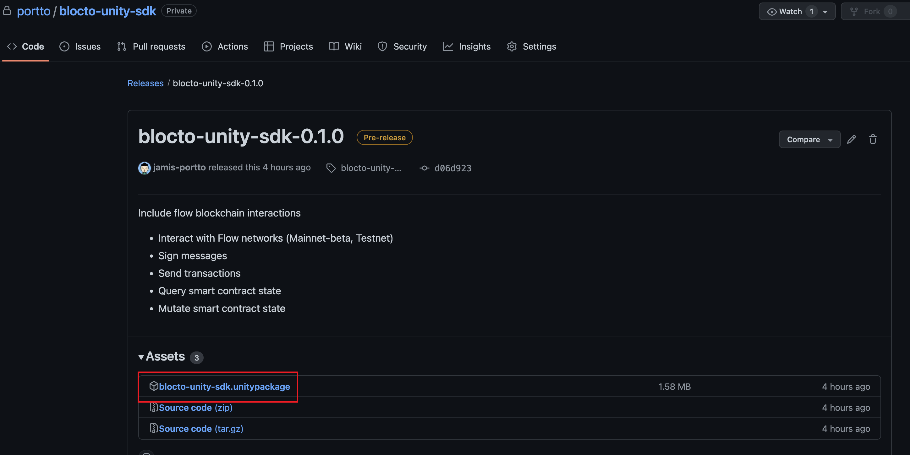
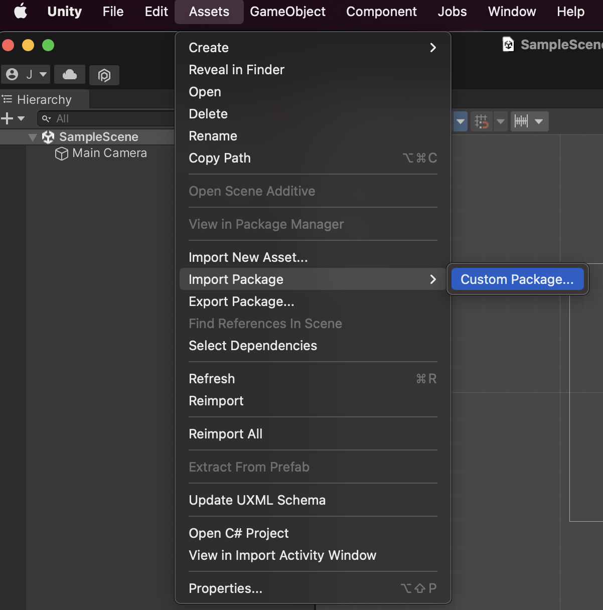

# Getting Started

In this guide we will show you prerequisite for Blocto Flow SDK.

A sample app is available at: [https://github.com/portto/blocto-unity-sdk](https://github.com/portto/blocto-unity-sdk)

## Installation

### Requirements <a href="#requirements" id="requirements"></a>

* .Net Core version >= 2.1
* iOS version >= 13
* Android version >= 7.1

### Release Page

* FCL-Unity and Blocto-unity-SDK is available through [github](https://github.com/portto/blocto-unity-sdk/releases). You can download at github [release page](https://github.com/portto/blocto-unity-sdk/releases)

<figure><figcaption><p>FCL-Unity download page</p></figcaption></figure>

<figure><figcaption><p>Blocto-unity-SDK download page</p></figcaption></figure>

## Import .unitypackage

You can import **Standard Asset Packages**, which are asset collections pre-made and supplied with Unity, and **Custom Packages**, which are made by people using Unity. More description at [unity document](https://docs.unity3d.com/Manual/AssetPackagesImport.html).

Choose **Assets > Import Package >** to import both types of package.

<figure><figcaption></figcaption></figure>

## Configuration

1. [Register app id](https://docs.blocto.app/blocto-sdk/register-app-id) (bloctoSDKAppId) in order to init `BloctoWalletProvider`
2. Set the require Configuration, the more description please go to the [flow document](https://developers.flow.com/tools/fcl-js/reference/configure-fcl#common-configuration-keys)
3. Create `BloctoWalletProvider` instance and register it with `FllowClientLibrary`

```csharp
using Flow.FCL;
using Flow.FCL.Config
using Blocto.SDK.Flow;

var config = new Config();
config.Put("discovery.wallet", "https://flow-wallet-dev.blocto.app/api/flow/authn")
      .Put("accessNode.api", "https://rest-testnet.onflow.org/v1")
      .Put("flow.network", "testnet");
        
var walletProvider = BloctoWalletProvider.CreateBloctoWalletProvider(
    initialFun: GetWallet => {
                    var walletProvider = GetWallet.Invoke(
                        gameObject,
                        new FlowUnityWebRequest(gameObject, config.Get("accessNode.api")),
                        new ResolveUtility());
                    
                    return walletProvider;
                },
    env: {"dev" or "mainnet"},
    bloctoAppIdentifier:Guid.Parse("d0c4c565-db60-4848-99c8-2bdfc6bd3576"));
        
var fcl = FlowClientLibrary.CreateClientLibrary(
    initialFun: GetFCL => {
                    var fcl = GetFCL.Invoke(gameObject, _walletProvider, new ResolveUtility());
                    return fcl;
                }, 
    config: config);
```

If you build unity on iOS platform, you will find LSApplicationQueriesSchemes in info.plist that created by blocto sdk. **Pleases, don’t remove it.**

<figure><figcaption></figcaption></figure>
