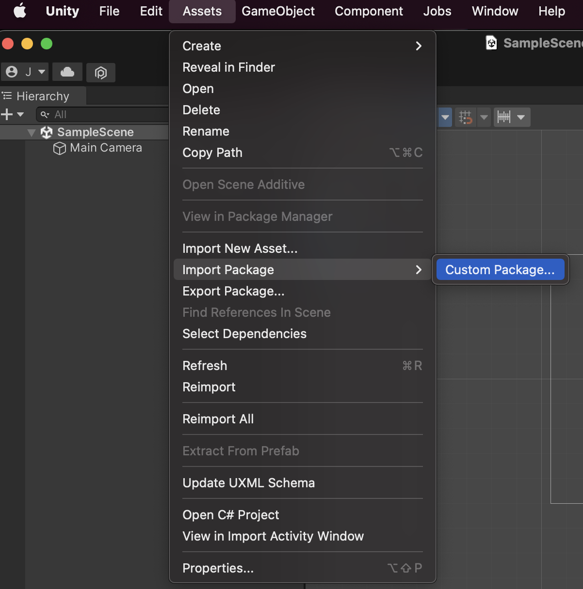

# Getting Started

In this guide we will show you prerequisite for Blocto Solana SDK.&#x20;

A sample app is available at: [https://github.com/portto/blocto-unity-sdk](https://github.com/portto/blocto-unity-sdk)

## Requirements <a href="#requirements-a-hrefrequirements-idrequirementsa" id="requirements-a-hrefrequirements-idrequirementsa"></a>

* .Net Core version >= 2.1
* iOS version >= 13
* Android version >= 7.1

## Release Page <a href="#release-page" id="release-page"></a>

coming soon

## Import .unitypackage <a href="#import-unitypackage" id="import-unitypackage"></a>

You can import **Standard Asset Packages**, which are asset collections pre-made and supplied with Unity, and **Custom Packages**, which are made by people using Unity. More description at [unity document](https://docs.unity3d.com/Manual/AssetPackagesImport.html).

Choose **Assets > Import Package >** to import both types of package.

<figure><figcaption></figcaption></figure>

## Wallet Provider <a href="#wallet-provider" id="wallet-provider"></a>

1. [Register app id](https://docs.blocto.app/blocto-sdk/register-app-id) (bloctoSDKAppId) in order to init `BloctoWalletProvider`
2. Create `BloctoWalletProvider` instance.

```csharp
using Blocto.Sdk.Core.Extension;
using Blocto.Sdk.Core.Utility;
using Blocto.Sdk.Solana;
        
var webRequestUtility = gameObject.AddComponent<WebRequestUtility>();
var bloctoWalletProvider = BloctoWalletProvider.CreateBloctoWalletProvider(
        gameObject: gameObject,
        env: EnvEnum.Devnet,
        bloctoAppIdentifier:Guid.Parse("{your app id}")
    );

```

## Solana Client <a href="#solana-client" id="solana-client"></a>

The Unity SDK integrates with [Solnet](https://github.com/bmresearch/Solnet) and provides the solana client to interact with the Solana blockchain, and you can access account data through the Solana client. For more information on the solana client, we recommend checking out solnet

```csharp
using Blocto.Sdk.Core.Extension;
using Blocto.Sdk.Core.Utility;
using Blocto.Sdk.Solana;
        
var account = bloctoWalletProvider.SolanaClient.GetAccountInfo({your account address});
```
